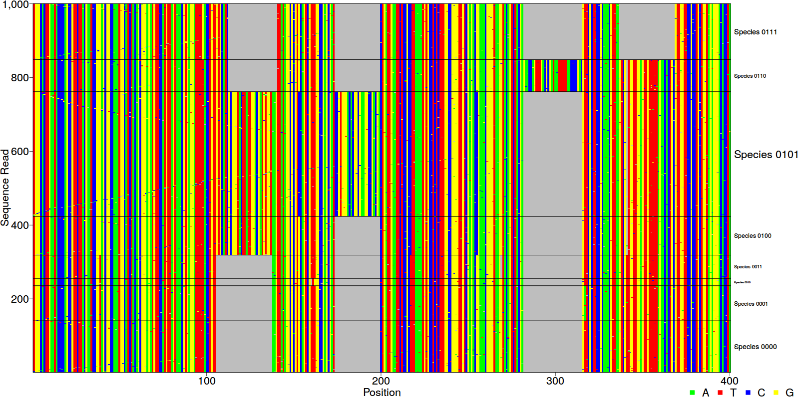

# DNAPlotR
An R library to plot a visual representation of a vector of DNA sequences. To install directly from github, use the [<code>devtools</code>](https://github.com/hadley/devtools) library and run:
```
devtools::install_github('sherrillmix/DNAPlotR')
```

The main function is:
* <code>plotDNA(seqs)</code> to take a character vector of strings representing DNA sequences and plot them to the current device. By default, A, C, T and G are colored, - are colored gray and all other characters are white. For example:

        seqs<-c('ACACA','ACACA','ACACT','ACA-A')
        plotDNA(seqs)


And helper functions are:
* <code>replaceOuterGaps(seqs)</code> to mark gaps at the ends of sequences differently than internal indels.  For example:

        seqs<-c('--AA-A','--AA--','A-AA-A')
        replaceOuterGaps(seqs)

A more complex example is:

        fakeSeqs<-createFakeDNA(1000)
        refSeq<-fakeSeqs[1]
        fakeSeqs<-fakeSeqs[-1]
        species<-sprintf('Species %s',sub(' [0-9]+$','',names(fakeSeqs)))
        par(mar=c(3.5,4.4,.5,7))
        plotDNA(fakeSeqs,groups=species,groupCexScale=TRUE)

To produce something like:

See [generatePlots.R](generatePlots.R) for complete plotting details.

